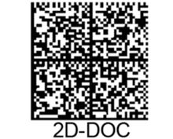

# PAO lib 2D-Doc

## Introduction
Le 2D-DOC est une spécification de datamatrix permettant à l’administration française d’embarquer des informations certifiés dans un document papier.
On peut citer comme exemple les justificatifs de domiciles ou les attestations vaccinales.

Le but de cette PAO est de créer une librairie en rust permettant d’interpréter le flux d’octets provenant d’un datamatrix en données structurées suivant les
spécifications de 2D-DOC.