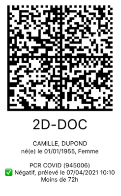

# 2DDoc Demo files
## 01-v2.png

### Source
https://commons.wikimedia.org/wiki/File:Code_barre_2D-Doc.png#/media/Fichier:Code_barre_2D-Doc.png
### Données
Texte:

>DC02FR000001125E125B0126FR247500010MME/SPECIMEN/NATACHA22145 AVENUE DES SPECIMENS54LDD5F7JD4JEFPR6WZYVZVB2JZXPZB73SP7WUTN5N44P3GESXW75JZUZD5FM3G4URAJ6IKDSSUB66Y3OWQIEH22G46QOAGWH7YHJWQ

Hexa:

>44433032465230303030303131323545313235423031323646523234373530303031304d4d452f53504543494d44e2f4e4154414348411d3232313435204156454e5545204445532053504543494d454e531d1f35344c44443546374a44344a4546505236575a59565a5642324a5a58505a4237335350375755544e354e34345033474553585737354a5a555a4435464d3347345552414a36494b4453535542363659334f57514945483232473436514f414757483759484a57510a

### Position
39,152:188,152:188,2:39,2

## 02-v4.png

### Source
Internet
### Données

Texte:

>DC04FR0000011E581E58B201FRF0DEPOTHPRIMF1NEGF201011955F3FF4945006F5NF6070420211010MRZICP23SZTCLV2APC5P2AQVZDKHDKRG5KOIYGBKDXUA7N5O75QLWMKJBFSL3WJZYG2HHF4Z3K5E6E2GJFOVSV7E2W2XVHEXXVDXYNY

Hexa:

>444330344652303030303031314535383145353842323031465246304445504f54485052494d1d46314e45471d4632303130313139353546334646343934353030361d46354e46363037303432303231313031301f4d525a4943503233535a54434c56324150433550324151565a444b48444b5247354b4f495947424b44585541374e354f3735514c574d4b4a4246534c33574a5a594732484846345a334b3545364532474a464f5653563745325732585648455858564458594e590a

### Position
14,224:228,224:228,10:14,10