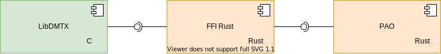

# lib2ddoc

## Lien utile
- https://asi-pao.insa-rouen.fr/sujet/200/
- https://github.com/dmtx/libdmtx
- https://gitlab.insa-rouen.fr/acamusat/lib2ddoc

### libdmtx
installation:
>apt install dmtx-utils

cli
>man dmtxquery

>man dmtxread

>man dmtxwrite

lib
>man libdmtx
https://github.com/dmtx/libdmtx/blob/master/test/simple_test/simple_test.c

```c
pxl = (unsigned char *)malloc(width * height * bytesPerPixel);
            assert(pxl != NULL);

img = dmtxImageCreate(pxl, width, height, DmtxPack24bppRGB);
assert(img != NULL);

dec = dmtxDecodeCreate(img, 1);
assert(img != NULL);

reg = dmtxRegionFindNext(dec, NULL);
if(reg != NULL) {
    msg = dmtxDecodeMatrixRegion(dec, reg, DmtxUndefined);
    if(msg != NULL) {
        fputs("output: \"", stdout);
        fwrite(msg->output, sizeof(unsigned char), msg->outputIdx, stdout);
        fputs("\"\n", stdout);
        dmtxMessageDestroy(&msg);
    }
    dmtxRegionDestroy(&reg);
}

dmtxDecodeDestroy(&dec);
dmtxImageDestroy(&img);
free(pxl);
```
## Foreign Function Interface.
Une interface de fonction étrangère (FFI) est un mécanisme par lequel un programme écrit dans un langage de programmation peut appeler des routines ou utiliser des services écrits dans un autre langage.
>https://doc.rust-lang.org/nomicon/ffi.html

```rust
extern crate libc;
use libc::size_t;

#[link(name = "snappy")]
extern {
    fn snappy_max_compressed_length(source_length: size_t) -> size_t;
}

fn main() {
    let x = unsafe { snappy_max_compressed_length(100) };
    println!("max compressed length of a 100 byte buffer: {}", x);
}
```



## Problématiques
1. Headers sont fixes, sans mot clé, seule info: taille
    - Pas de syntaxe. On connait juste la taille

2. Pour parser un couple Message(ID, donnée), il faut des infos lié a la doc ( soit fct(ID) ): taille min, taille max
    - Implémentation de f(ID):
        a)Une fonction par ID ( via generation automatique du code ) => code dupliqué, gros binaire
        b)fct(ID) via Hashmap (Hashmap ajouté a la lib au moment du build)
    - Validité du 2D-Doc (champ obligatoire, facultatif, interdit: fct(header(' type de document ')))
    
3. Signature sur entête + messages => Verifier avant de decoder